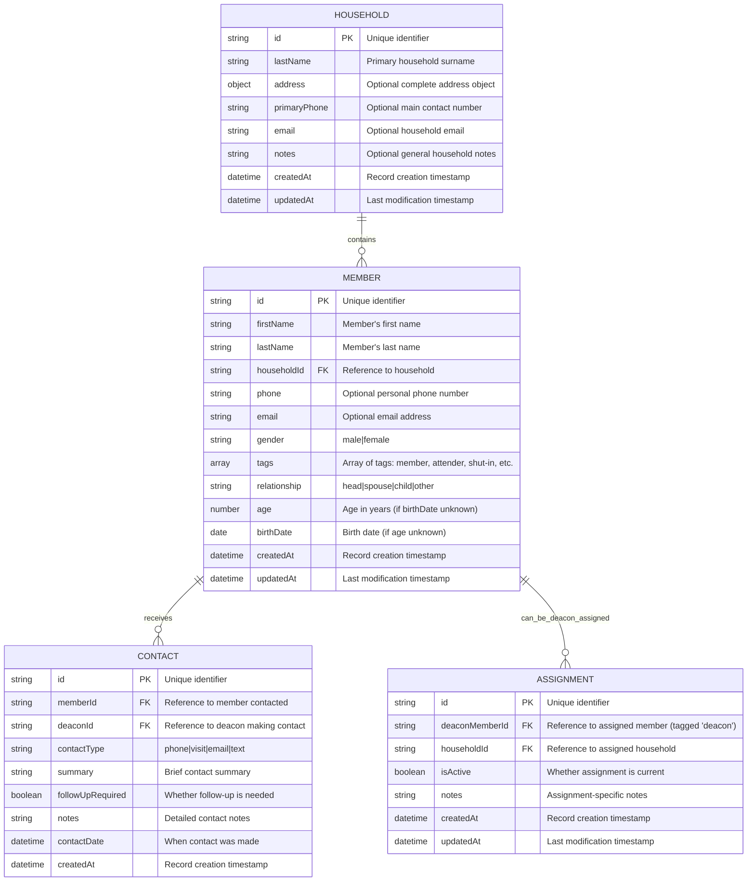

# Deacon Care System - Database Schema

This document defines the data model for the Deacon Care System using Mermaid ER diagrams.

## Entity Relationship Diagram



## Collection Schemas for Sengo

### Households Collection
```javascript
{
  _id: ObjectId,
  lastName: String, // Required
  address: {        // Optional
    street: String,
    city: String,
    state: String,
    zipCode: String
  },
  primaryPhone: String, // Optional
  email: String,        // Optional
  notes: String,        // Optional
  createdAt: Date,
  updatedAt: Date
}
```

### Members Collection
```javascript
{
  _id: ObjectId,
  firstName: String,    // Required
  lastName: String,     // Required
  householdId: ObjectId, // Required - Reference to household
  phone: String,        // Optional
  email: String,        // Optional
  gender: String,       // Required - 'male' or 'female'
  tags: [String],       // Optional array - 'member', 'attender', 'shut-in', 'cancer', 'long-term-needs', 'widow', 'widower', 'married', 'deceased'
  relationship: String, // Required - 'head', 'spouse', 'child', 'other'
  age: Number,         // Optional - use if birthDate unknown
  birthDate: Date,     // Optional - use if age unknown
  createdAt: Date,
  updatedAt: Date
}
```

### Contacts Collection
```javascript
{
  _id: ObjectId,
  memberId: [ObjectId], // Array of references to members
  deaconId: [ObjectId], // Array of references to deacons
  contactType: String, // 'phone', 'visit', 'email', 'text'
  summary: String,
  followUpRequired: Boolean,
  notes: String,
  contactDate: Date,
  createdAt: Date
}
```


### Assignments Collection
```javascript
{
  _id: ObjectId,
  deaconMemberId: ObjectId, // Reference to member with tag 'deacon'
  householdId: ObjectId, // Reference to household
  isActive: Boolean,
  notes: String,
  createdAt: Date,
  updatedAt: Date
}
```

## Key Design Decisions

1. **Document-Based Storage**: Optimized for sengo's S3-based document storage
2. **Denormalized Data**: Some redundancy for read performance (common in NoSQL)
3. **Deacons Are Members**: Deacons are represented as members with a 'deacon' tag; assignments reference member IDs.
4. **Audit Trail**: CreatedAt/updatedAt timestamps on all entities
5. **Soft Deletes**: Status fields instead of hard deletes for data integrity
6. **Contact Tracking**: Simple contact tracking for deacon accountability
7. **Needs Management**: Member needs will be tracked (implementation approach TBD)
8. **Monthly Reporting**: System will support monthly deacon reporting requirements

## Indexing Strategy for Sengo

Since sengo provides searchability, these fields should be indexed:
- `households`: lastName, primaryPhone, email
- `members`: firstName, lastName, householdId, gender, tags, relationship
- `contacts`: memberId, deaconMemberId, contactDate
- `assignments`: deaconMemberId, householdId, isActive
