# Deacon Care System - Database Schema

This document defines the data model for the Deacon Care System using Mermaid ER diagrams.

## Entity Relationship Diagram

```mermaid
erDiagram
    HOUSEHOLD {
        string id PK "Unique identifier"
        string lastName "Primary household surname"
        object address "Complete address object"
        string primaryPhone "Main contact number"
        string notes "General household notes"
        datetime createdAt "Record creation timestamp"
        datetime updatedAt "Last modification timestamp"
    }
    
    MEMBER {
        string id PK "Unique identifier"
        string firstName "Member's first name"
        string lastName "Member's last name"
        string householdId FK "Reference to household"
        string phone "Personal phone number"
        string email "Email address"
        string status "active|inactive|deceased|moved"
        string relationship "head|spouse|child|other"
        datetime createdAt "Record creation timestamp"
        datetime updatedAt "Last modification timestamp"
    }
    
    CONTACT {
        string id PK "Unique identifier"
        string memberId FK "Reference to member contacted"
        string deaconId FK "Reference to deacon making contact"
        string contactType "phone|visit|email|text"
        string summary "Brief contact summary"
        boolean followUpRequired "Whether follow-up is needed"
        string notes "Detailed contact notes"
        datetime contactDate "When contact was made"
        datetime createdAt "Record creation timestamp"
    }
    
    DEACON {
        string id PK "Unique identifier"
        string firstName "Deacon's first name"
        string lastName "Deacon's last name"
        string email "Email address"
        string phone "Phone number"
        boolean isActive "Whether deacon is currently active"
        string notes "Assignment-specific notes"
        datetime createdAt "Record creation timestamp"
        datetime updatedAt "Last modification timestamp"
    }
    
    ASSIGNMENT {
        string id PK "Unique identifier"
        string deaconId FK "Reference to assigned deacon"
        string householdId FK "Reference to assigned household"
        boolean isActive "Whether assignment is current"
        string notes "Assignment-specific notes"
        datetime createdAt "Record creation timestamp"
        datetime updatedAt "Last modification timestamp"
    }
    
    %% Relationships
    HOUSEHOLD ||--o{ MEMBER : "contains"
    MEMBER ||--o{ CONTACT : "receives"
    DEACON ||--o{ CONTACT : "makes"
    DEACON ||--o{ ASSIGNMENT : "responsible_for"
    HOUSEHOLD ||--o{ ASSIGNMENT : "assigned_to"
```



## Collection Schemas for Sengo

### Households Collection
```javascript
{
  _id: ObjectId,
  lastName: String,
  address: {
    street: String,
    city: String,
    state: String,
    zipCode: String
  },
  primaryPhone: String,
  notes: String,
  createdAt: Date,
  updatedAt: Date
}
```

### Members Collection
```javascript
{
  _id: ObjectId,
  firstName: String,
  lastName: String,
  householdId: ObjectId, // Reference to household
  phone: String,
  email: String,
  status: String, // 'active', 'inactive', 'deceased', 'moved'
  relationship: String, // 'head', 'spouse', 'child', 'other'
  createdAt: Date,
  updatedAt: Date
}
```

### Contacts Collection
```javascript
{
  _id: ObjectId,
  memberId: ObjectId, // Reference to member
  deaconId: ObjectId, // Reference to deacon
  contactType: String, // 'phone', 'visit', 'email', 'text'
  summary: String,
  followUpRequired: Boolean,
  notes: String,
  contactDate: Date,
  createdAt: Date
}
```

### Deacons Collection
```javascript
{
  _id: ObjectId,
  firstName: String,
  lastName: String,
  email: String,
  phone: String,
  isActive: Boolean,
  createdAt: Date,
  updatedAt: Date
}
```

### Assignments Collection
```javascript
{
  _id: ObjectId,
  deaconId: ObjectId, // Reference to deacon
  householdId: ObjectId, // Reference to household
  isActive: Boolean,
  notes: String,
  createdAt: Date,
  updatedAt: Date
}
```

## Key Design Decisions

1. **Document-Based Storage**: Optimized for sengo's S3-based document storage
2. **Denormalized Data**: Some redundancy for read performance (common in NoSQL)
3. **Flexible Assignment Model**: Deacons are assigned to households, not individual members
4. **Audit Trail**: CreatedAt/updatedAt timestamps on all entities
5. **Soft Deletes**: Status fields instead of hard deletes for data integrity
6. **Contact Tracking**: Simple contact tracking for deacon accountability
7. **Needs Management**: Member needs will be tracked (implementation approach TBD)
8. **Monthly Reporting**: System will support monthly deacon reporting requirements

## Indexing Strategy for Sengo

Since sengo provides searchability, these fields should be indexed:
- `households`: lastName, primaryPhone
- `members`: firstName, lastName, householdId, status
- `contacts`: memberId, deaconId, contactDate
- `deacons`: email, isActive
- `assignments`: deaconId, householdId, isActive
