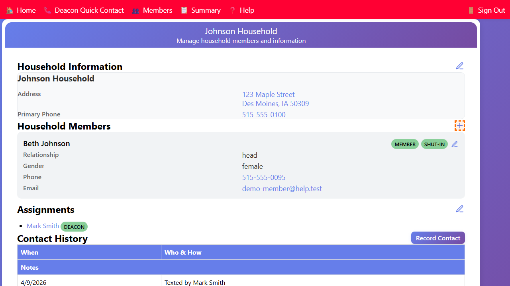

## Adding a Member to a Household

You can add a new member directly to an existing household from the Household page.

1. Open the **Household** page for the household.
2. In the **Household Members** section, click the **+** (Add Member) button.

3. The **Edit Member** form opens, pre-linked to this household.
4. Fill in the member's details (see *Editing Member Information* for field descriptions).
5. Click **Save** to add the member to the household.

The new member will appear in the household's member list after saving.
