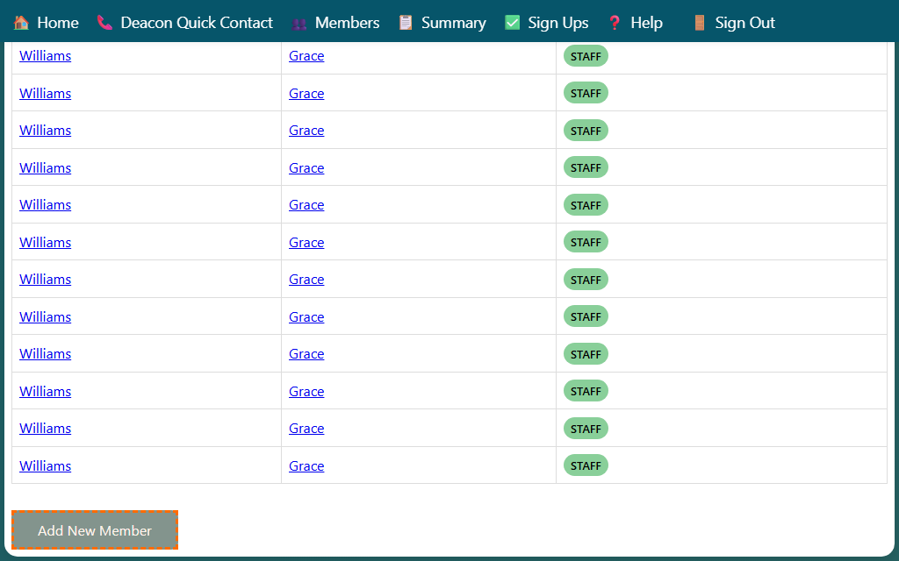

## Adding a New Member

You can add a new member to the system from the Members page.

1. Go to the **Members** page.
2. Click the **Add New Member** button at the top of the page.

3. The **Edit Member** form opens. Fill in the member's details (see the *Editing Member Information* section of the edit-member help page for field descriptions).
4. Click **Save** to create the member record.

> **Tip:** To add a member to an existing household, open the household page and use the **+** (Add Member) button there instead. That automatically links the new member to the household.
