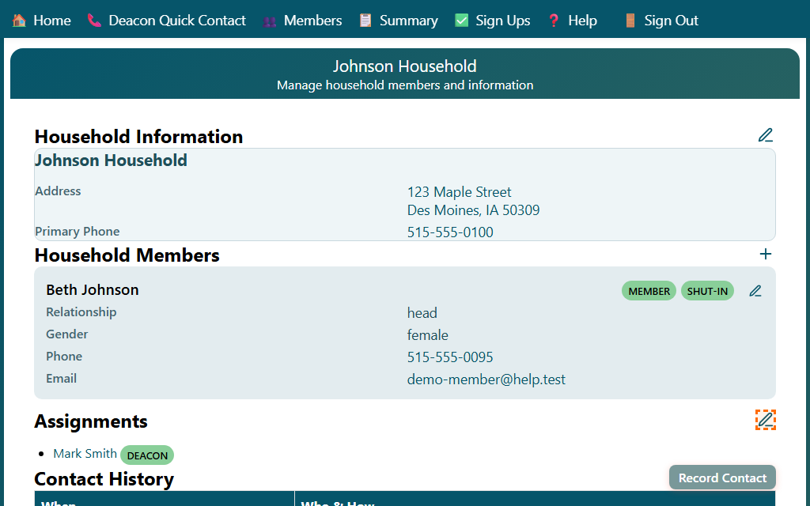
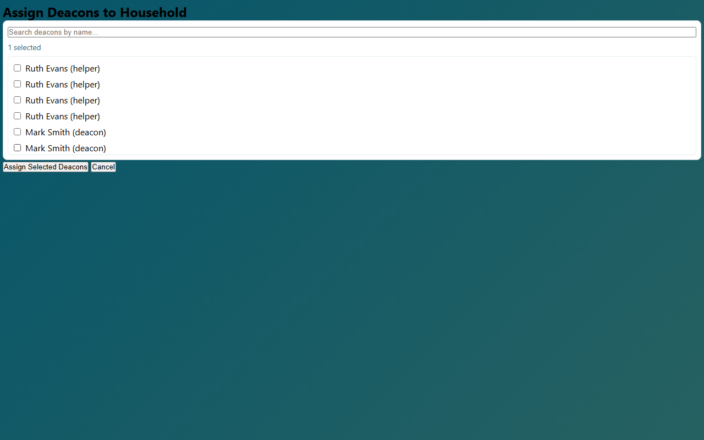
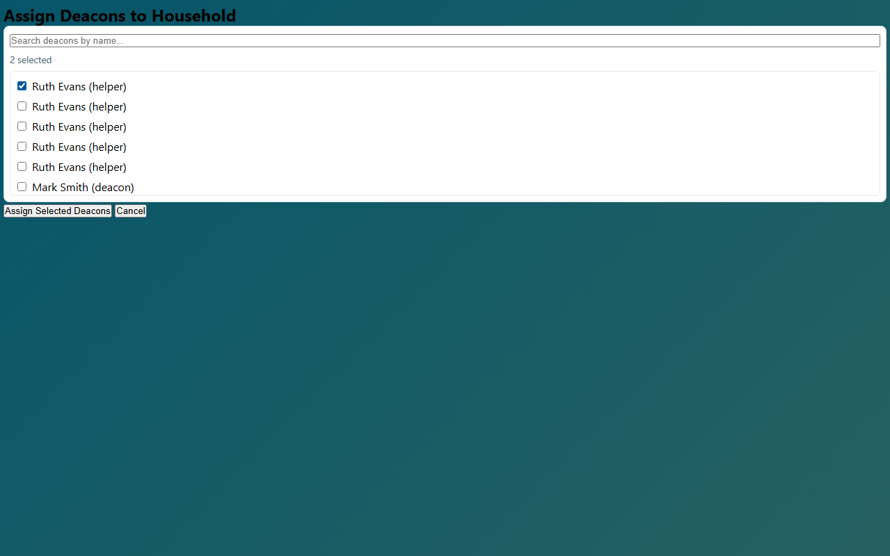

## Assigning Deacons to a Household

You can assign one or more deacons (or H.E.L.P. workers) to care for a household.

1. Open the **Household** page for the household.
2. In the **Assignments** section, click the **✏️ Edit** button.

3. The **Assign Deacons** page opens showing a list of all deacons and H.E.L.P. workers.
4. Check the box next to each person you want to assign to this household.
   - People currently assigned will already have their box checked.
   - Uncheck a box to remove an existing assignment.

5. Click **Assign Selected Deacons** to save the assignments.
6. Click **Cancel** to go back without making changes.

After saving, the updated assignment list appears on the Household page.
