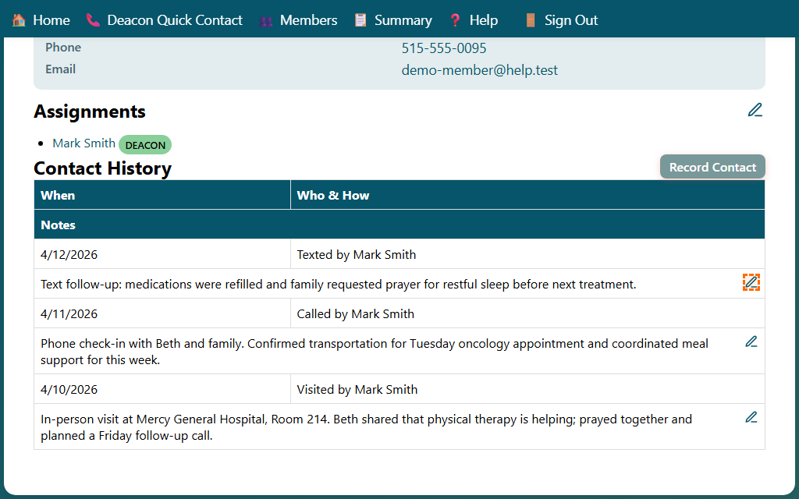

## Editing a Saved Contact

You can edit an existing contact directly from the household **Contact History** section.

1. Open the **Household** page.
2. Scroll to **Contact History**.
3. Find the contact entry you want to update.
4. Click the **Edit Contact** icon in the top-right of that entry's notes row.

The **Record Contact** form opens in edit mode with the current details loaded.

1. Update the date, type, summary, participants, or follow-up fields as needed.
2. Click **Submit**.

After saving, you return to the household page and the updated contact appears in Contact History.