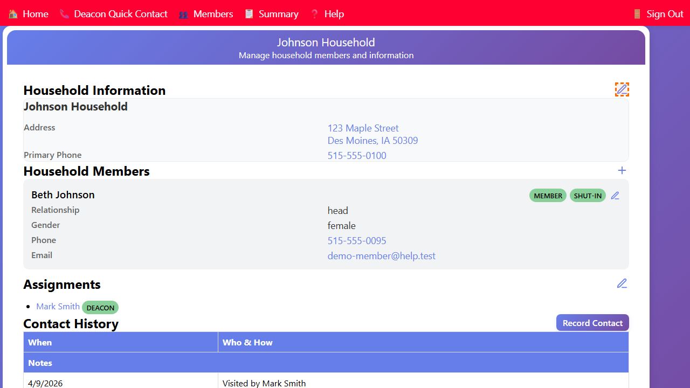
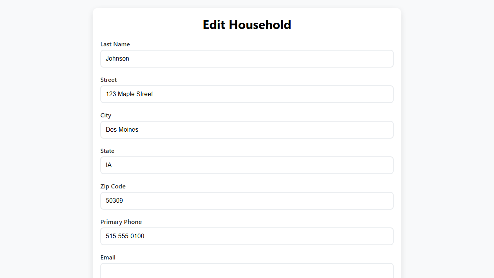

## Editing Household Information

You can update a household's address, phone number, email, and notes.

1. Open the **Household** page for the household you want to edit.
2. In the **Household Information** section, click the **✏️ Edit** (pencil) button.

3. The **Edit Household** form opens with the current details pre-filled.
4. Update any of the following fields:
   - **Last Name** — the family name used to identify the household
   - **Primary Phone** — the main contact phone number
   - **Address** — street address, city, state, and zip code
   - **Email** — household email address
   - **Notes** — any general notes about the household
5. Click **Save** to save your changes.

