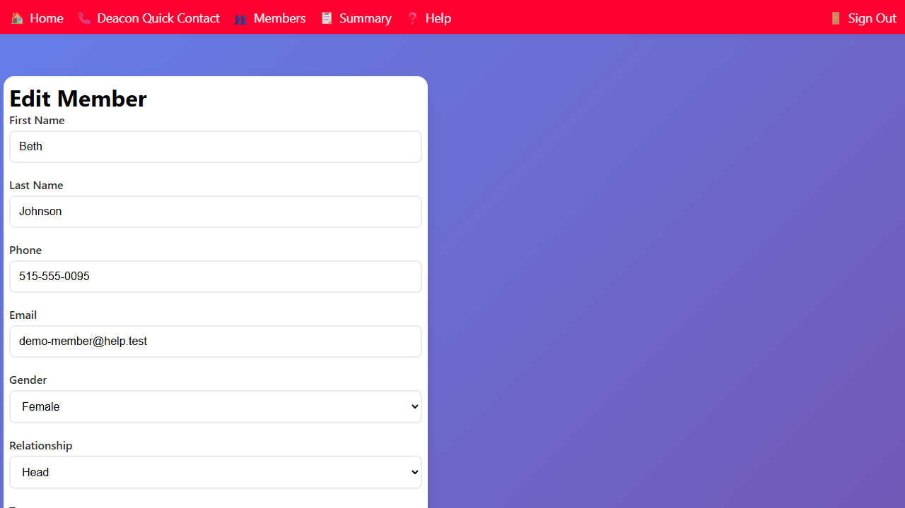

## Editing Member Information

You can update a member's name, phone number, email, gender, and relationship to their household.

### Opening the Edit Member Form

- From the **Household** page: click the member's name in the Members section.
- From the **Members** page: click a member's name to open their household, then click the member's name.

### Editing Basic Information

The form shows the following fields:

- **First Name** and **Last Name**
- **Phone** — the member's personal phone number
- **Email** — the member's personal email address
- **Gender** — Male or Female
- **Relationship** — the member's role in the household (e.g., Head, Spouse, Child, Other)

The Current Location section lets you record a common location or facility when the member is away from home.

### Saving Changes

Click **Save** to save your changes. Click **Cancel** to discard changes and return to the household page.
