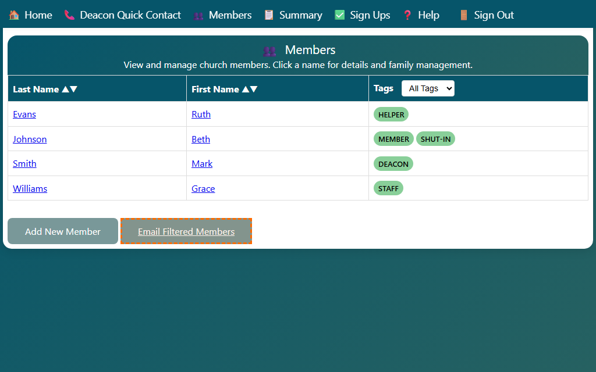

## Emailing the Filtered Members List

You can send a single email to everyone currently shown in the member list, using your own email software.

1. On the Members page, use the **Filter by tag** dropdown to narrow the list to the group you want to contact (for example, all deacons).
2. Click the **Email Filtered Members** button at the bottom of the page.

3. Your default email application opens a new message with every visible member's name and email address already filled in on the **To:** line.
4. Write your message and send it as usual.

> **Tip:** If none of the currently filtered members have an email address on file, the button has no effect. Add email addresses on each member's Edit Member page first.
