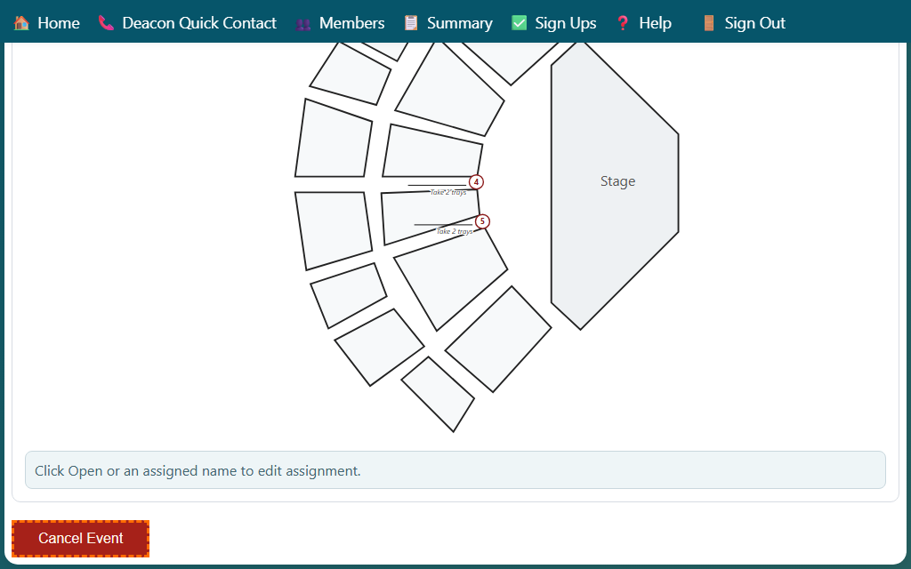
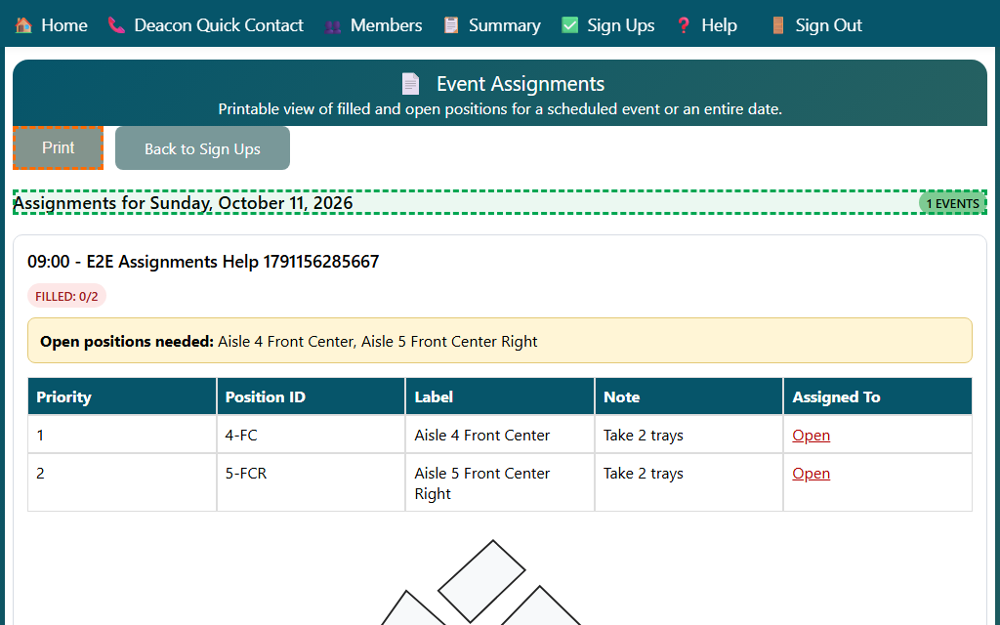

## Reviewing Event Assignments

Use the Event Assignments page to review who is filled, what is still open, and to print the assignment sheet for a single event or an entire service date.

1. Open Event Assignments from a **Sign Ups** date link, or open the page directly when you already have the event or date selected.
2. Review the header at the top of the page.
   - For a single event, it shows the service time and event title.
   - For a service date, it shows the date and the number of events on that day.
3. Look at the status badge and the open-positions callout.
   - The badge shows how many positions are filled.
   - The callout lists the positions that still need to be assigned.
4. Review the table for priority, position ID, label, notes, and current assignment.
5. Review the worship center map below the table.
   - Each aisle shows the assigned person's name, with the position note underneath when there is one.
   - Aisles with no one assigned show a blank line, so a name can be written in by hand on the printout.
   - The map appears only for events whose positions are tied to aisle numbers.
6. Click **Print** to print the assignment sheet, including the map.

## Canceling an Event

1. Open the event's assignment view, or open the full service-date view.
2. Scroll to the bottom of the page. If you have permission, click **Cancel Event** under the assignment sheet. In a service-date view, each event you can manage has its own button.
3. Confirm cancellation in the prompt. The cancelled event no longer appears in upcoming sign-ups.

Admins, staff, and event leaders with assignment-management access can cancel events. If you do not see **Cancel Event** and need an event cancelled, contact the event leader or an admin.

Events cannot be moved to a new date. Sign-ups must be completed and confirmed again by everyone for the new date. Ask an event leader or admin to cancel the old event and schedule a new one; everyone must sign up for the new event again.

For editing assignments or adding new assignment candidates, see the Event Assignments help sections on changing assignments and quick-add.

