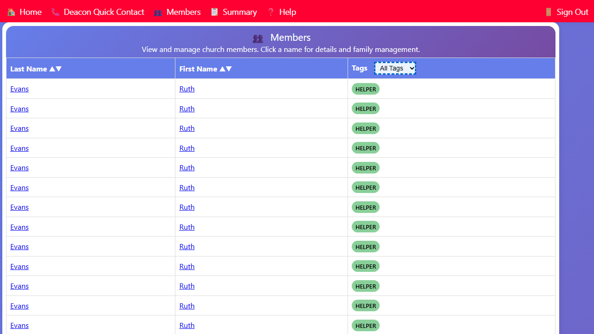

## Filtering Members by Tag

You can narrow the member list to show only members with a specific tag (such as shut-in, cancer, or widow).

1. On the Members page, find the **Filter by tag** dropdown at the top of the list.
2. Select a tag from the dropdown.

The list immediately updates to show only members with that tag.

3. To clear the filter and show all members again, select **All** from the dropdown.

Common tags you may filter by include:

- **shut-in** — members who are homebound
- **cancer** — members with cancer
- **long-term-needs** — members with ongoing care needs
- **widow** — widows or widowers
