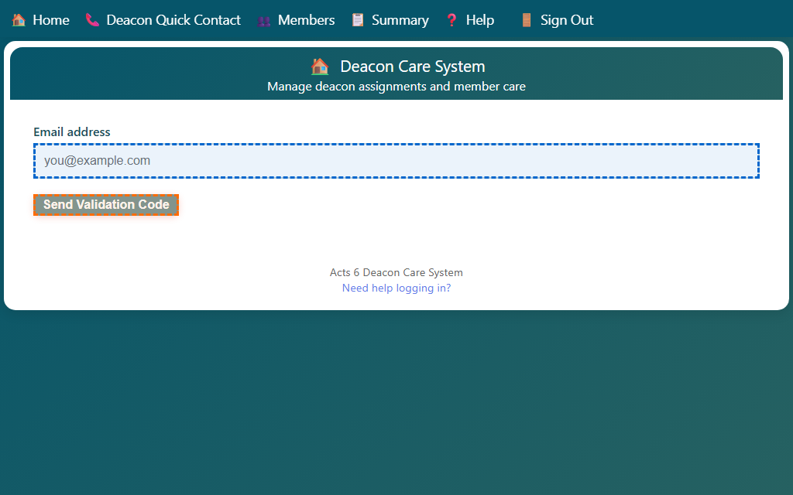
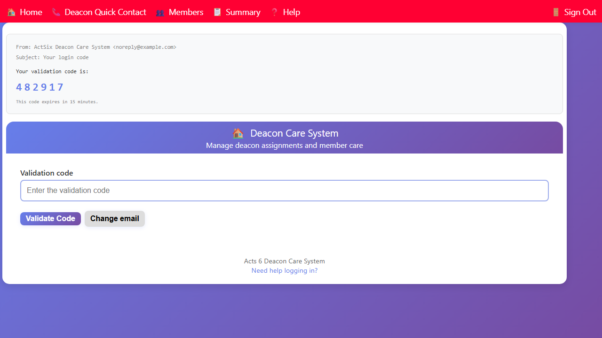
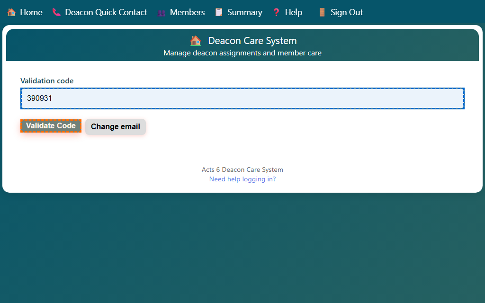

## Logging In

This app uses a passwordless email login. No password is needed — instead you receive a one-time code by email each time you sign in.

### Step 1 — Enter your email address

1. Open the login page in your browser.
2. Type your email address in the **Email address** field.
3. Click **Send Validation Code**.

The app sends a validation code to your inbox immediately. The code is valid for **15 minutes**.

### Step 2 — Find the code in your email

Check your inbox for an email from the Deacon Care System. It looks like this:

> **From:** ActSix Deacon Care System
>
> **Subject:** Your login code
>
> Your validation code is:
>
> **482917**
>
> This code expires in 15 minutes. If you did not request this code, you can ignore this email.

The code is a **6-digit number**. Copy or note it down.

### Step 3 — Enter the code

1. Return to the login page (it now shows the **Validation code** field).
2. Type the 6-digit code in the **Validation code** field.
3. Click **Validate Code**.

### Step 4 — You are signed in

After a successful code validation, the app redirects you to the Home page automatically. You do not need to do anything else.

---

> If you did not receive a code or cannot access your email, contact your site administrator.
