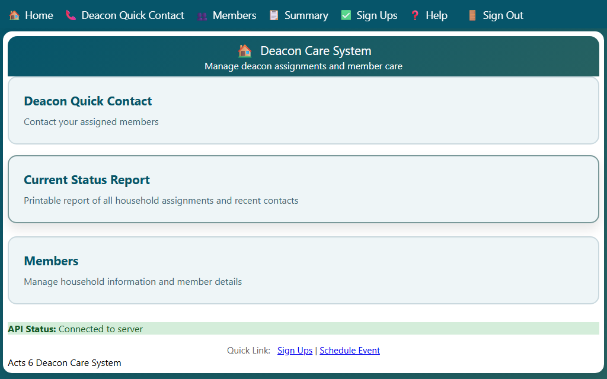
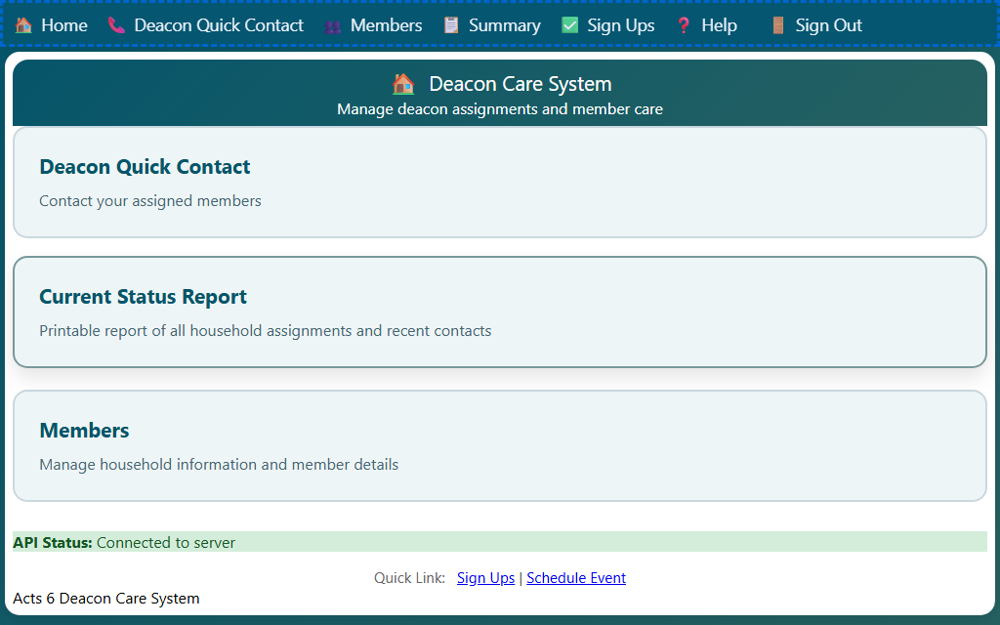

## Navigating the App

After you log in, the Home page shows the main areas of the app.

### Home Page Cards

The home page displays cards that link to the main sections:

- **Deacon Quick Contact** — view your assigned households and record care contacts
- **Current Status Report** — see all household assignments and recent contact history
- **Members** — browse and search the full member directory

For eligible roles, the home page also shows quick links for **Sign Ups** and **Schedule Event** below the cards.

Click any card to open that section.

### Top Navigation Bar

Every page has a navigation bar at the top of the screen.

- **🏠 Home** — return to the home page
- **📞 Deacon Quick Contact** — go to your contact list
- **👥 Members** — go to the member directory
- **📋 Summary** — go to the contact summary report
- **✅ Sign Ups** — review upcoming services and mark your availability
- **🗓️ Schedule Event** — create new service times when you have permission
- **❓ Help** — open help for the current page
- **🚪 Sign Out** — sign out of the app

On a phone or small screen, tap the **☰** menu button in the top-right corner to open the navigation menu.
