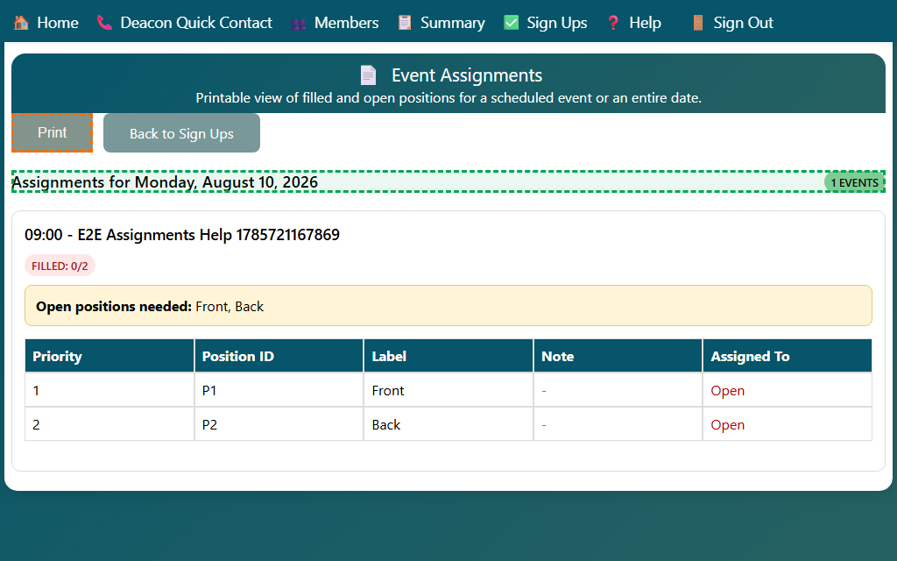

## Adding a New Usher During Assignments

Use this when the person you need is not in the assignment list yet.

1. Open **Event Assignments** for the event.
2. Click **Open** (or an assigned name) for the position you want to edit.
3. In the assignment panel, click **Add new member**.
4. Enter the person's full name, then click **Add Member**.
   - The system creates a new member record and adds the person to the assignment options.
   - For events configured with usher quick-add, the person is tagged as an usher automatically.
5. Select the newly added person and click **Save** to assign them.

Tip: Some events enforce a required gender for assignment candidates. The quick-add form follows that event rule.

