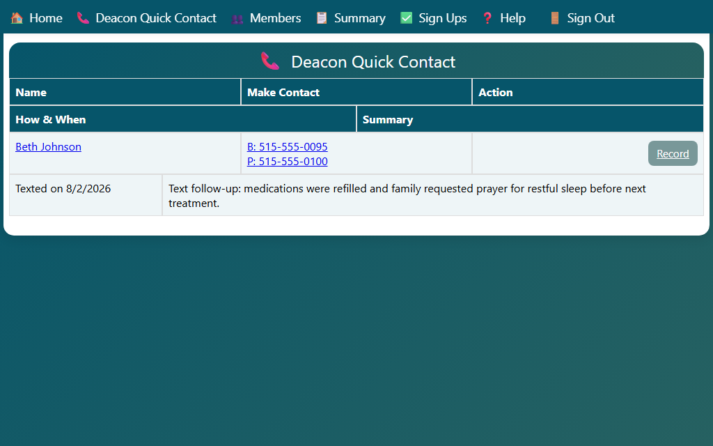

## Deacon Quick Contact Overview

The Deacon Quick Contact page gives you a streamlined view of the households assigned to you, with quick access to contact information and the ability to record contacts.

1. Click **📞 Deacon Quick Contact** in the navigation bar, or click the **Deacon Quick Contact** card on the home page.

The page lists each household assigned to you with:

- **Household name**
- **Primary phone number** — tap on a phone to call directly from a mobile device
- **Address** — with a link to open directions in a maps app
- **Last contact date** — when you last recorded contact with this household
- **Assigned members** — the members in the household, including any active current locations

### Recording a Contact from Quick Contact

To record a contact for a household directly from this page, click the **Record Contact** link next to the household.

This opens the Record Contact form pre-populated with the household's members. See *Recording a Contact* for details.
