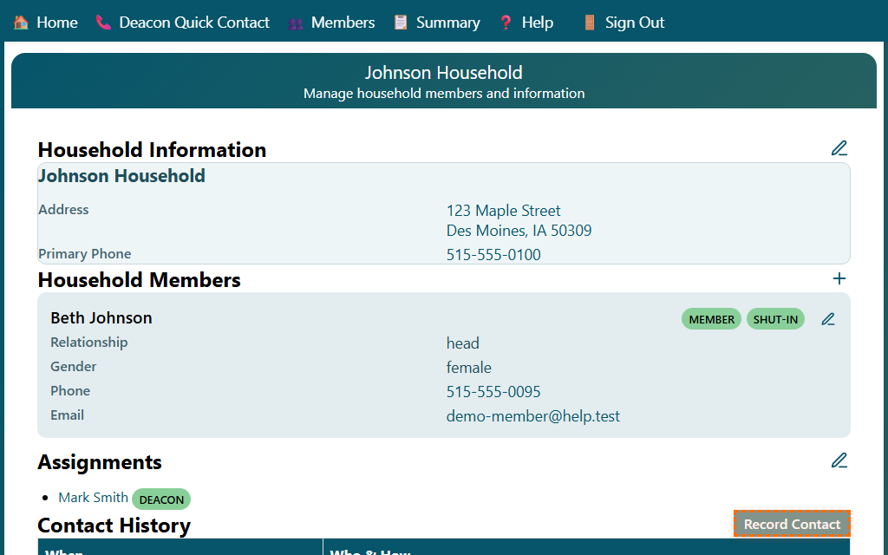
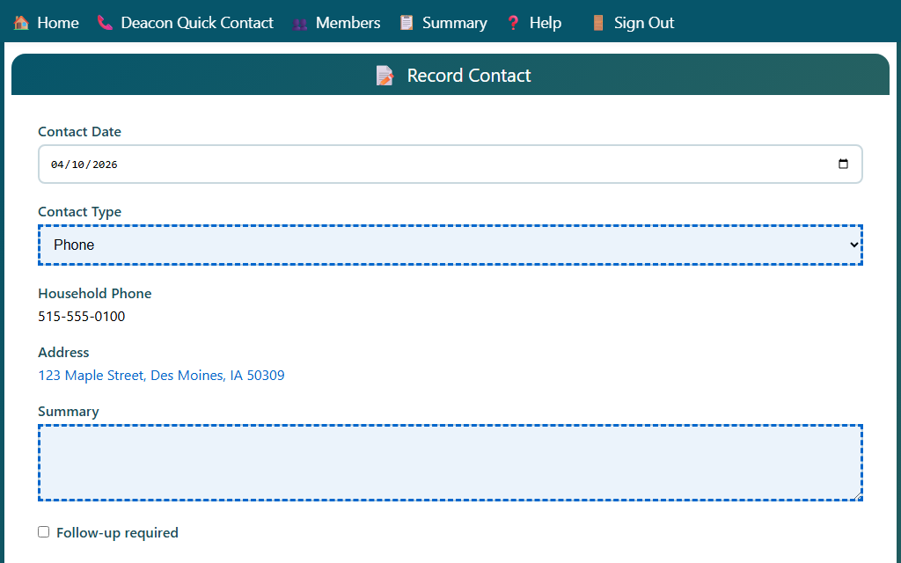
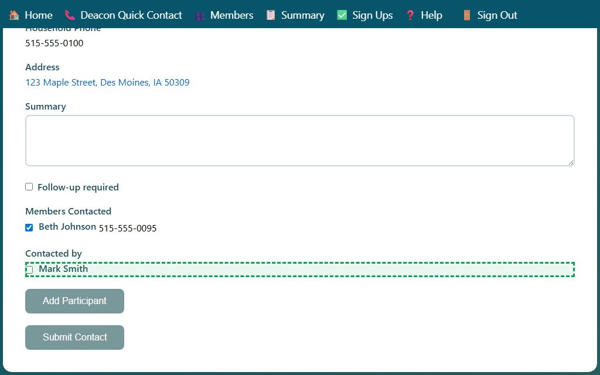

## Recording a Contact

Use the Record Contact form to log a care contact with one or more members of a household.

### Opening the Form

- From the **Household** page: click **Record Contact** in the Contact History section.
- From the **Deacon Quick Contact** page: click the **Record Contact** link next to a household.

### Filling in the Form

1. **Contact Date** — defaults to today. Change it if you are recording a past contact.
2. **Contact Type** — choose how the contact was made:
   - **Phone** — phone call
   - **Visit** — in-person visit
   - **Text** — text message
   - **Voice mail** — left a voicemail
   - **At Church** — spoke at a church service or event
   - **Note** — a general note (no person-to-person contact required)
3. **Summary** — type a brief description of the contact.
4. **Follow-up required** — check this box if a follow-up action is needed.

### Selecting Members Contacted

The **Members Contacted** section lists the members who were part of this contact.

- Members with needs tags (shut-in, cancer, long-term needs) are pre-selected automatically.
- Check or uncheck members as needed.
- At least one member must be selected.

### Selecting Who Made the Contact (Contacted by)

The **Contacted by** section lists who participated in making the contact.

- Your name is pre-selected if you have a deacon or H.E.L.P. role.
- To add another participant, click **Add Participant** and select from the list.
- At least one person must be listed (except for contact type **Note**).

### Saving the Contact

Click **Submit** to save the contact record. You are returned to the household page.
