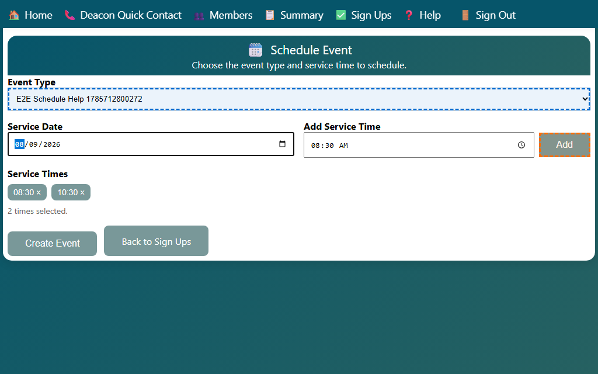

## Scheduling an Event

Use the Schedule Event page to create one or more service times for a date. The page sends you back to Sign Ups after the event is saved.

1. Open **Schedule Event** from the home page or the top navigation bar.
2. Choose the event type you want to schedule.
3. Pick the service date.
   - The page fills in common service times automatically based on the day of the week.
4. Add one or more service times.
   - Type a time in the field and click **Add**, or press **Enter**.
   - Click a time chip to remove it before saving.
5. Click **Create Event**.
6. After the save finishes, the page shows a confirmation message and returns to **Sign Ups**.

