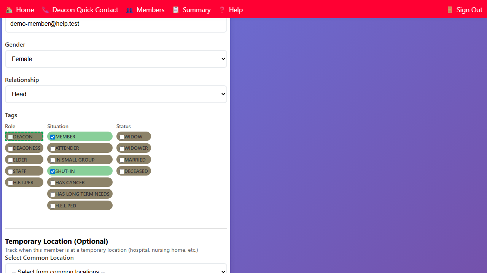

## Setting Member Tags

Tags classify a member's situation, role, and status. They are used for filtering and determining care assignments.

Tags are set on the **Edit Member** form. Open a member's form by clicking their name from the Household or Members page.

### Tag Groups

**Role tags** — the member's ministry role:

- **deacon** — assigned deacon
- **staff** — administrative staff
- **helper** — H.E.L.P. worker
- **elder** — church elder

**Situation tags** — current life situation:

- **shut-in** — homebound member
- **cancer** — member with cancer
- **long-term-needs** — member with ongoing care needs
- **widow** — widow or widower

**Status tags:**

- **deceased** — member has passed away (hides the member from most lists)

### How to Set Tags

1. Open the **Edit Member** form for the member.
2. In the **Tags** section, check the boxes for the tags that apply.
   - Checked tags are highlighted.
   - Unchecked tags appear grayed out.

3. Click **Save** to save the tag changes.
