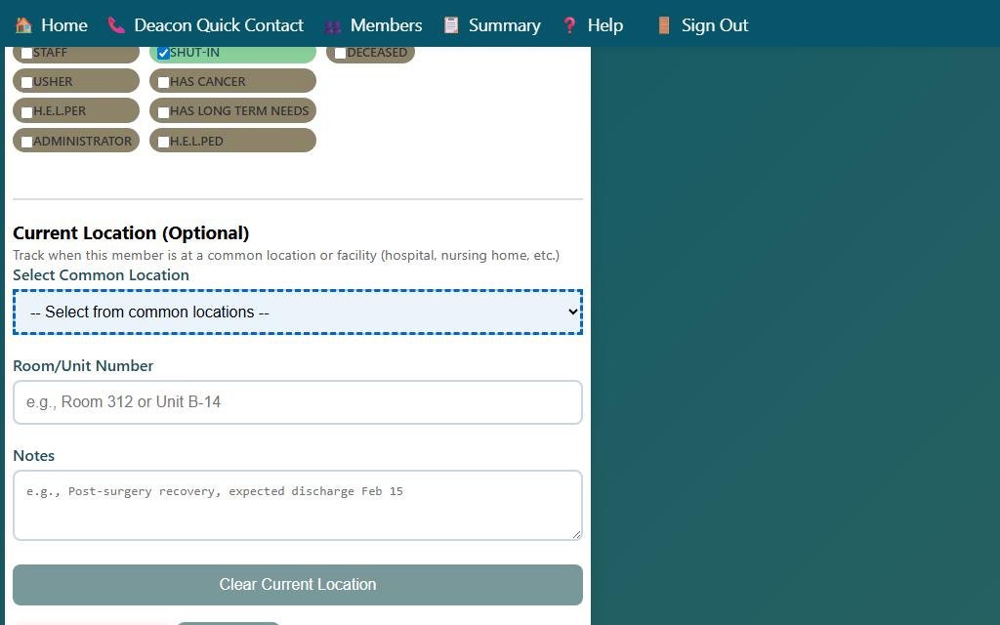

## Setting a Current Location

If a member is staying somewhere other than their home for an extended period, such as a hospital, rehab facility, nursing home, or assisted-living center, you can record that current location.

### Adding a Current Location

1. Open the **Edit Member** form for the member.
2. Scroll to the **Current Location** section.
3. Start typing the location name in the **Location** search field. A dropdown list of known common locations appears.
   - Select a location from the list, or type a custom location name if needed.

4. Fill in:
   - **Room Number** — the specific room or unit number (optional)
   - **Start Date** — when the stay began
   - **Notes** — any additional details, such as unit notes or visiting hours

5. Click **Save** to save the current location.

### Removing a Current Location

1. Open the **Edit Member** form.
2. In the **Current Location** section, clear the location field or use the remove option.
3. Click **Save**.

> The current location appears on the Household page, the Contact Summary report, the Deacon Quick Contact page, and the Record Contact form, so deacons know where to reach the member.
