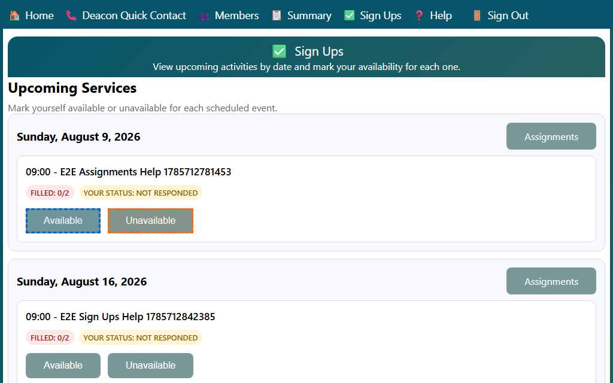

## Managing Your Sign-Ups

The Sign Ups page groups upcoming services by date. Use it to tell the team whether you are available for each event and to open the assignment list when it is available.

1. Open **Sign Ups** from the home page or the top navigation bar.
2. Review the service dates at the top of each section.
   - Each event card shows the service time, event title, filled count, and your current status.
   - If you have not answered yet, the badge says **Not responded**.
3. Click **Available** if you can serve, or **Unavailable** if you cannot.
   - The page saves your choice right away and updates the status badge.
   - After you pick one option, the page shows the opposite button so you can change your answer later.
4. If an **Assignments** button appears for a date, open it to review that date's assignment list.

