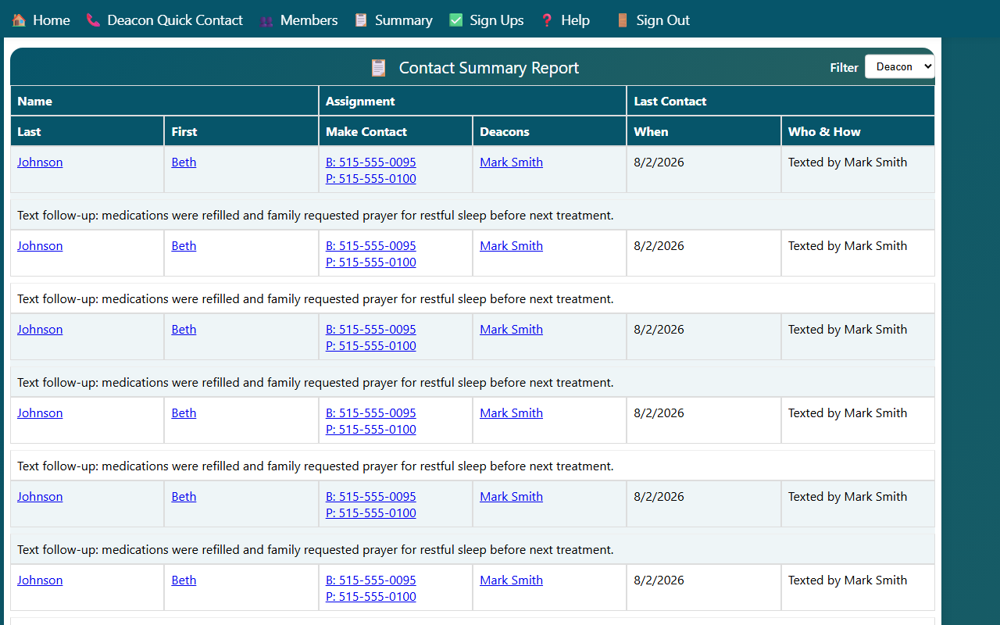
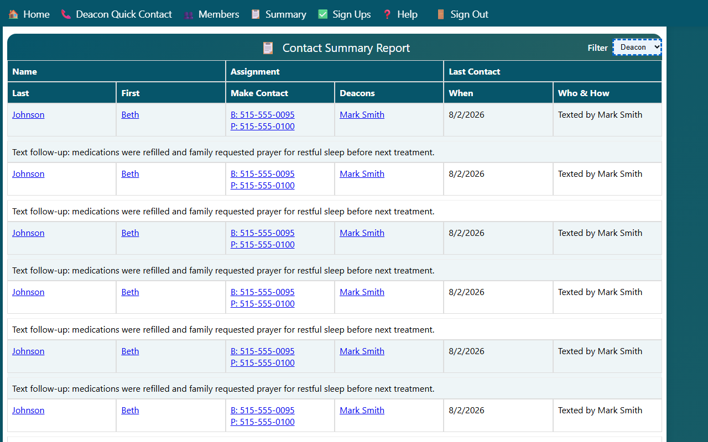

## Viewing the Contact Summary Report

The Contact Summary Report gives an overview of all household assignments and recent contact activity across the congregation.

1. Click **📋 Summary** in the navigation bar, or click the **Current Status Report** card on the home page.

The report table shows one row per household with:

- **Name** — household last name and the primary contact's first name
- **Make Contact** — the best contact method for the household. If a member is currently in a facility, the current location and address appear first, followed by any household or spouse phone numbers.
- **Deacons** — all deacons or helpers assigned to the household
- **Last Contact — When** — the date of the most recent recorded contact
- **Last Contact — Who & How** — who made the contact and the contact type

The Notes column shows only the latest contact summary. It does not display the current location box.

### Filtering by Assignment Type

Use the **Filter** dropdown in the top-right corner to limit the report:

- **All** — show all households
- **Deacon** — show only households assigned to a deacon
- **H.E.L.P.** — show only households assigned to an H.E.L.P. worker

The filter defaults to the type that matches your role when you first open the page.
