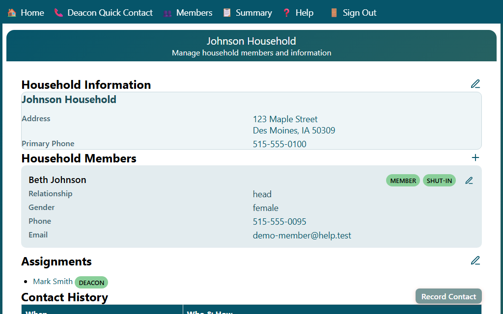

## Viewing Household Details

The Household page shows all information for a single household.

1. Open a household by clicking a member's name on the Members page, or by following a link from another page.

The page displays:

- **Household name and contact information** — address, primary phone number, and email
- **Household Members** — a list of all members in the household with their name, phone, and email
- **Deacon Assignments** — the deacons currently assigned to care for this household

### Navigating from the Household Page

From the household page you can:

- Click a member's name to edit that member's information
- Click a deacon's name to view their contact details
