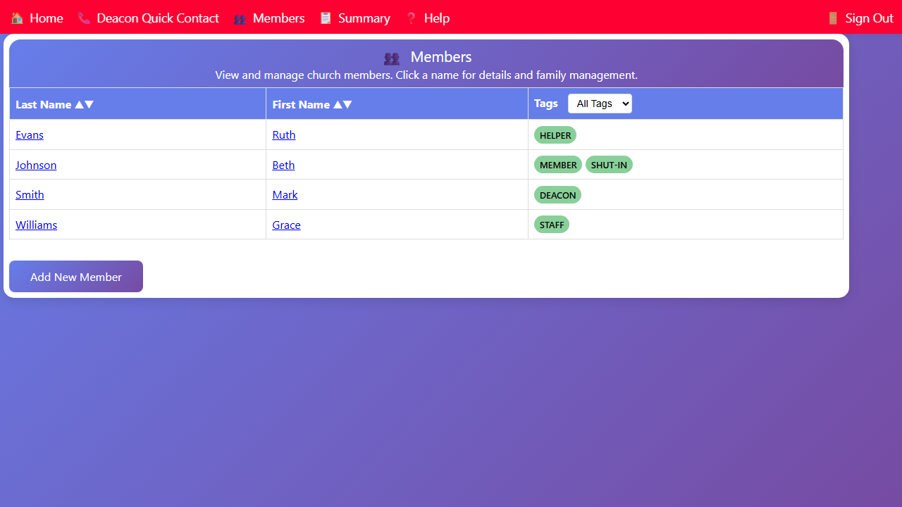

## Viewing the Members List

The Members page shows all active members of the congregation.

1. Click **👥 Members** in the navigation bar, or click the **Members** card on the home page.
2. The page loads a table with every active member (deceased members are not shown).

### Sorting the List

Click a column heading to sort:

- **Last Name ↑↓** — sort alphabetically by last name
- **First Name ↑↓** — sort by first name

Click the same heading again to reverse the sort order.

### Opening a Member's Household

Click any member's name or row to open that member's household page, where you can see full household details, contact history, and assigned deacons.
